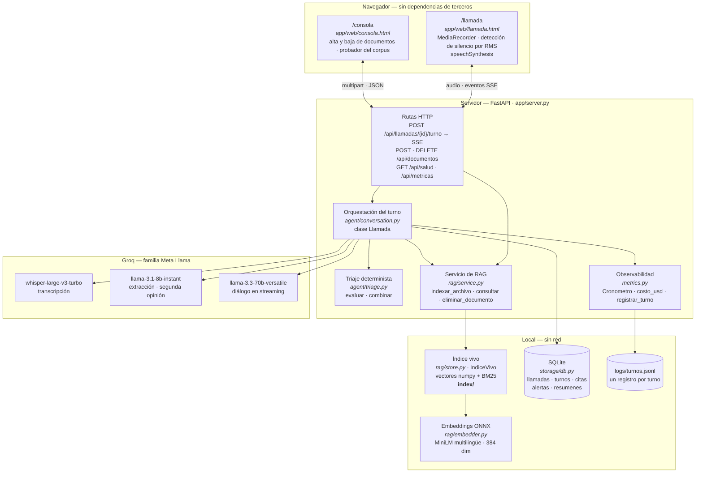
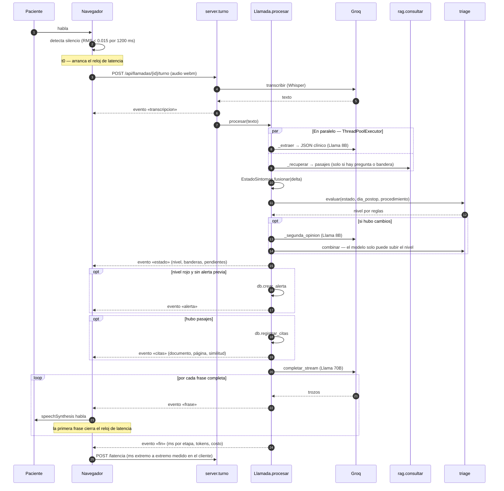
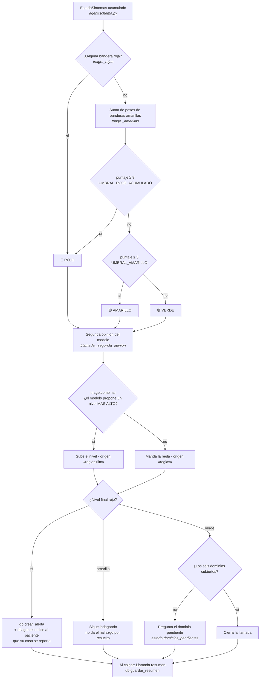
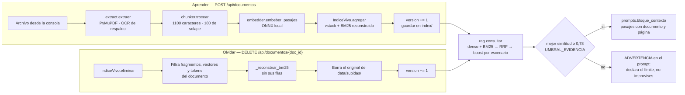

# Arquitectura y flujo de decisión

Entregable 02. Cada elemento de estos diagramas nombra un símbolo real del código, con su
archivo, para que se pueda verificar uno por uno.

---

## 1. Componentes

---

## 2. Un turno de conversación

**Por qué la respuesta se emite por frases.** El paciente empieza a oír al agente con la
primera frase, mientras el modelo todavía genera el resto. Es la diferencia entre un
silencio de dos segundos y uno de medio segundo, y es la razón de que el endpoint devuelva
un stream de eventos en vez de un JSON.

**Por qué el reloj lo cierra el cliente.** La rúbrica define la latencia hasta que
*empieza a sonar* el audio. Ese instante ocurre en el navegador, no en el servidor.

---

## 3. Flujo de decisión del agente

### Las banderas rojas — escalan siempre, solas

Definidas en [`triage._rojas`](../app/agent/triage.py). Ninguna depende de un puntaje: una
sola basta.

| Código | Condición |
|---|---|
| `fiebre_alta` | Temperatura ≥ 38,0 °C (`FIEBRE_ROJA`) |
| `herida_purulenta` | Secreción purulenta en la herida |
| `dehiscencia` | Apertura de la herida |
| `sangrado_activo` | Sangrado activo por la herida |
| `movilidad_incapacitante` | Incapacidad nueva para moverse |
| `dolor_severo` | Dolor ≥ 8/10 |
| `dolor_subito` | Dolor de aparición súbita e intensa |
| `disnea` | Dificultad para respirar |
| `dolor_toracico` | Dolor en el pecho |
| `sincope` | Desmayo o pérdida de conciencia |
| `confusion` | Confusión o desorientación nueva |
| `vomito_persistente` | Vómito que no cede |
| `intolerancia_oral` | No tolera líquidos ni alimentos |
| `signos_tvp` | Pierna hinchada, caliente, roja o dolorosa |
| `ictericia` | Piel u ojos amarillos |
| `sin_transito_intestinal` | Sin gases ni deposición desde el día 3, **solo** en cirugía abdominal |

### Las banderas amarillas — suman

| Código | Peso | Condición |
|---|---:|---|
| `febricula` | 2 | 37,5 °C ≤ temperatura < 38,0 °C |
| `fiebre_no_medida` | 2 | Refiere fiebre pero no tiene termómetro |
| `eritema_leve` | 2 | Enrojecimiento alrededor de la herida |
| `dolor_sobre_lo_esperado` | 1–2 | Dolor por encima de lo esperable ese día |
| `movilidad_limitada_tardia` | 1 | Movilidad limitada desde el día 7 |
| `apetito_muy_disminuido` | 2 | Apetito muy disminuido |
| `apetito_disminuido_tardio` | 1 | Apetito disminuido desde el día 7 |
| `sueno_muy_alterado` | 2 | Sueño muy alterado |

**El dolor se juzga contra el día postoperatorio, no contra un número fijo**
([`triage.dolor_esperado`](../app/agent/triage.py)): un 5/10 el día 1 es curso normal; el
mismo 5/10 el día 14 no lo es. Umbrales esperados: día 1 → 6, día 3 → 5, día 7 → 4,
día 14 → 3.

### Las tres decisiones de diseño que sostienen esto

**Las reglas deciden; el modelo solo puede escalar.** Un modelo de lenguaje no da garantía
dura sobre un umbral, y la rúbrica declara el falso negativo como falla catastrófica. Con
reglas, una temperatura de 38,0 °C escala siempre, sin importar lo tranquilizador que suene
el paciente. El modelo aporta lo que las reglas no anticiparon —una combinación rara, un
contexto que agrava— pero [`triage.combinar`](../app/agent/triage.py) descarta cualquier
propuesta de bajar el nivel.

**`None` no es lo mismo que "normal".** Todo campo de `EstadoSintomas` empieza en `None`,
que significa *no se preguntó o el paciente no respondió*. El agente no puede cerrar la
llamada dando por sano un dominio que nunca consultó, y el resumen lo declara
explícitamente en `temas_no_cubiertos`.

**Una bandera positiva no se apaga.** En [`EstadoSintomas.fusionar`](../app/agent/schema.py),
un `false` posterior no borra un `true` ya confirmado: si el paciente reportó dificultad
para respirar en el turno 3 y en el turno 6 dice que ya está bien, la bandera sigue activa
para el triaje.

---

## 4. Conocimiento vivo

**Por qué un índice propio y no una base vectorial empaquetada.** La compuerta G5 exige que
eliminar un documento lo borre de verdad. Aquí el borrado reconstruye las estructuras sin
las filas del documento, así que no queda residuo posible en un índice aproximado ni en una
caché interna. El contador `version` sube con cada mutación y la consola lo muestra como
prueba de que el índice que responde es el mismo que se acaba de modificar.

**Por qué búsqueda híbrida.** El corpus es bilingüe y mezcla guías clínicas con
instructivos para el paciente. La búsqueda densa capta la intención («se me abrió la
herida» → *wound dehiscence*); BM25 capta el término exacto cuando el paciente usa la
palabra técnica. Se fusionan con Reciprocal Rank Fusion, que es robusto ante escalas de
puntaje incomparables entre ambos métodos ([`IndiceVivo.buscar`](../app/rag/store.py)).

**Por qué el escenario sube el puntaje pero no filtra.** El corpus tiene guías
transversales —manejo del dolor, protocolos ERAS, tromboprofilaxis— que aplican a
cualquier cirugía. Filtrar por escenario las dejaría fuera; multiplicar por 1,25 las del
escenario del paciente las prioriza sin perderlas.

---

## 5. Qué queda registrado

| Dónde | Qué | Cuándo |
|---|---|---|
| `llamadas` | paciente, procedimiento, día postop, nivel final | al iniciar y al cerrar |
| `turnos` | cada intervención, con el nivel vigente | cada turno |
| `citas` | documento, página, `chunk_id`, similitud | cada vez que se cita el corpus |
| `alertas` | nivel, motivo, banderas y estado clínico completo | al alcanzar rojo, una sola vez por llamada |
| `resumenes` | el resumen estructurado íntegro | al cerrar la llamada |
| `logs/turnos.jsonl` | ms por etapa, tokens, invocaciones, costo, latencia del cliente | cada turno |

Todo es inspeccionable durante la evaluación con cualquier cliente de SQLite, o desde
`GET /api/llamadas/{id}` y la consola.
